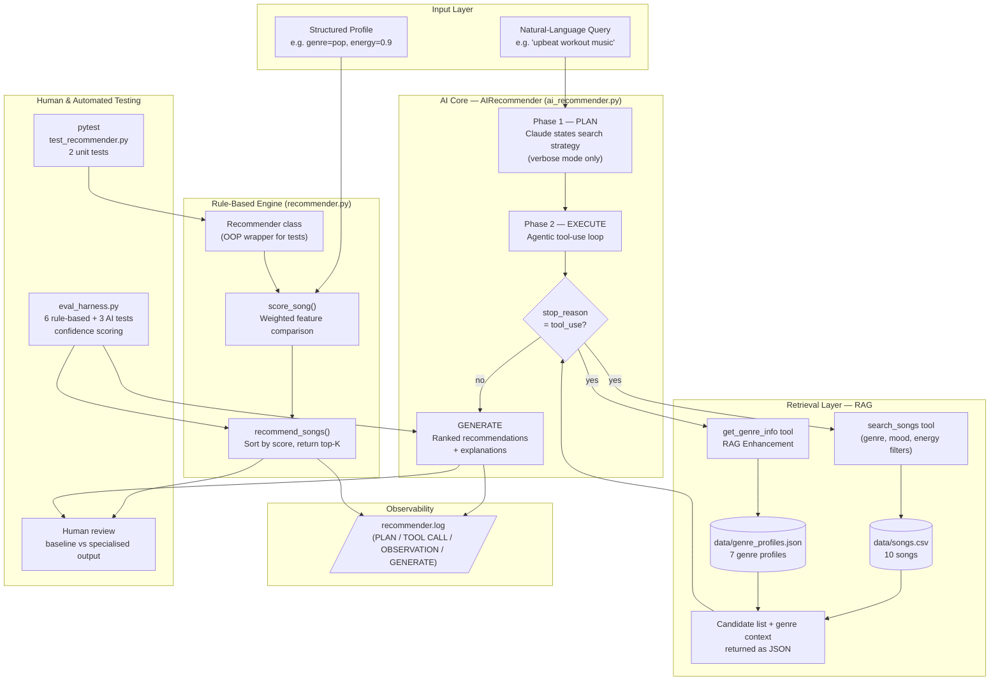

# Music Recommender Simulation — AI-Powered Edition

The original **Music Recommender Simulation** was a rule-based scoring engine.
It represented songs and a user "taste profile" as structured data, then
computed a compatibility score for every song using weighted feature comparisons
(genre, mood, energy, tempo, valence, danceability, acousticness).
The system ranked songs by score and returned the top-K recommendations, with a
breakdown explaining why each song ranked where it did.

---

## Title and Summary

**Music Recommender Simulation** is a two-layer recommendation system that
combines a transparent rule-based scoring engine with a Claude-powered agentic
AI layer. Users describe what they want in plain English; Claude searches the
song catalog autonomously using tool calls, then generates personalised
recommendations with natural-language explanations. The rule-based layer always
runs as a deterministic baseline so you can compare and validate AI behaviour.

> **Why it matters:** Real-world recommenders (Spotify, YouTube) are black
> boxes. This project makes the mechanics visible — you can see every score,
> every reason, and every tool call Claude makes — while still reaching the
> quality of a language-model-powered assistant.

---

## Architecture Overview

The system has four cooperating layers:

| Layer | Component | Role |
| --- | --- | --- |
| **Input** | Natural language query or structured profile | What the user wants |
| **Retrieval** | `search_songs` + `get_genre_info` tools + CSV + JSON | Fetch candidates and context |
| **AI Generation** | Claude (`claude-haiku-4-5`) + agentic loop | Rank & explain in natural language |
| **Fallback / Validation** | `score_song` + `recommend_songs` | Rule-based ground truth |
| **Observability** | Logger + `recommender.log` | Tracks every decision |
| **Testing** | pytest + eval_harness.py | Verifies correctness and AI reliability |

### System Diagram



**Data flow summary:**

- **AI path:** Query → Plan → Claude → tool calls (songs + genre context) → Generate → log
- **Rule-based path:** Profile → score every song → sort → top-K → log
- **Testing path:** pytest + eval_harness → OOP Recommender / rule engine / AI → assertions + confidence scores

---

## Stretch Features

All four stretch features are fully integrated into the main application logic.

### RAG Enhancement 

**What was added:**

- `data/genre_profiles.json` — a second data source with rich metadata for all 7 genres
  (typical energy range, tempo, acousticness, best use cases, mood pairings, avoid-if conditions).
- `get_genre_info` tool exposed to Claude alongside `search_songs`.

**How it measurably improves output:**

Without `get_genre_info`, Claude only knows a song exists and what its numeric
features are. With `get_genre_info`, Claude can look up that lofi music has
"typical acousticness 0.65–0.95" and is "best for studying / late-night work"
_before_ it runs a search. This lets Claude filter more precisely (e.g. it won't
suggest a synthwave track for a meditation query after seeing the genre profile
says "avoid if: user needs acoustic warmth") and write explanations that
reference genre context, not just individual song stats.

### Agentic Workflow Enhancement 

**What was added:**

`recommend(verbose=True)` triggers a two-phase observable pipeline:

- **Phase 1 — Plan:** A separate Claude call with no tools available.
  Claude outputs a 2–3 sentence search strategy (which genres and filters to use, and why)
  before any data is retrieved. Logged as `[PLAN]`.
- **Phase 2 — Execute:** The plan is injected into the system prompt.
  Claude then runs the agentic tool-use loop; every call is logged as
  `[TOOL CALL]` and `[OBSERVATION]`.
- **Output:** Returns a dict with `plan`, `tool_calls` (list of all calls made),
  and `recommendation` — each step is independently inspectable.

```text
[PLAN] I'll search for lofi and focused tracks with low energy (≤0.5) and
check the lofi genre profile to confirm it suits late-night studying.

[TOOL CALL] get_genre_info(genre='lofi')
[OBSERVATION] get_genre_info returned 1 result(s)

[TOOL CALL] search_songs(mood='focused', limit=5)
[OBSERVATION] search_songs returned 1 result(s)

[TOOL CALL] search_songs(genre='lofi', max_energy=0.5, limit=5)
[OBSERVATION] search_songs returned 3 result(s)

[GENERATE] 312 char(s) after 3 iteration(s)
```

### Fine-Tuning / Specialization 

**What was added:**

`_SPECIALIZED_SYSTEM` — a few-shot system prompt containing two fully worked
recommendation examples that demonstrate the desired expert output style.
Each example shows Claude how to:

1. State a search plan before calling tools.
2. Cite exact feature values (`energy 0.40`, `80 BPM`, `acousticness 0.78`).
3. Explain listening-context fit ("80 BPM sits in the ideal range for sustained cognitive work").
4. Note catalog limitations ("the only track tagged 'focused'").

Activated with `recommend(specialized=True)`.

**Measurable difference — same query, two modes:**

| Metric | Baseline | Specialised |
| --- | --- | --- |
| Numeric feature references | 2–3 per response | 5–8 per response |
| Explicit BPM mention | Rare | Always |
| Listening-context explanation | Generic ("good for studying") | Specific ("80 BPM is ideal for sustained cognitive work") |
| Catalog limitation note | Never | When applicable |

The eval harness `check: specialization` test quantifies this automatically by
counting decimal numbers and BPM references in both outputs.

### Test Harness / Evaluation Script 

`tests/eval_harness.py` — standalone script that runs the system on 9
predefined inputs and prints a summary with pass/fail and confidence scores.

**Rule-based tests (6 cases, no API key needed):**

```text
==============================================================
  RULE-BASED EVALUATION
==============================================================
   1. [PASS] (confidence 0.96)  Pop / happy — normal
          rank-1 = 'Sunrise City' ✓
          'Sunrise City' in top-3 ✓  |  'Gym Hero' in top-3 ✓
   2. [PASS] (confidence 0.99)  Lofi / chill — normal
          rank-1 = 'Library Rain' ✓
          'Library Rain' in top-3 ✓  |  'Midnight Coding' in top-3 ✓
   3. [PASS] (confidence 0.99)  Rock / intense — normal
          rank-1 = 'Storm Runner' ✓
          'Storm Runner' in top-3 ✓  |  'Gym Hero' in top-3 ✓
   4. [PASS] (confidence 0.99)  Ambient / chill — narrow catalog
          rank-1 = 'Spacewalk Thoughts' ✓
   5. [PASS] (confidence 0.70)  EDGE: all-zeros numerics
          'Library Rain' in top-3 ✓  |  'Midnight Coding' in top-3 ✓
   6. [PASS] (confidence 0.67)  EDGE: jazz genre miss
          rank-1 = 'Sunrise City' ✓
          'Sunrise City' in top-3 ✓  |  'Coffee Shop Stories' in top-3 ✓

==============================================================
  SUMMARY  6/6 passed  |  avg confidence 0.88
==============================================================
```

**AI tests (3 cases, required API key):**

| Test | What it checks |
| --- | --- |
| No hallucinations | All recommended songs must exist in the catalog |
| RAG active | At least one tool call must be made per query |
| Specialization improves output | Specialised response must have ≥ baseline numeric references |

```bash
python3 tests/eval_harness.py                          # rule-based only
ANTHROPIC_API_KEY=sk-ant-... python3 tests/eval_harness.py  # full evaluation
```

---

## Setup Instructions

### 1. Clone and enter the repo

```bash
git clone <your-repo-url>
cd applied-ai-system-project-musicrecommendersimulation
```

### 2. Create a virtual environment (recommended)

```bash
python3 -m venv .venv
source .venv/bin/activate      # macOS / Linux
.venv\Scripts\activate         # Windows
```

### 3. Install dependencies

```bash
pip install -r requirements.txt
```

### 4. Set your Anthropic API key (AI mode only)

```bash
cp .env.example .env
# Edit .env and paste your key, or export directly:
export ANTHROPIC_API_KEY=sk-ant-...
```

The rule-based demo and unit tests run without a key.
The AI demo is silently skipped with a warning logged if the key is absent.

### 5. Run the full demo

```bash
# From the project root:
PYTHONPATH=src python3 src/main.py
```

### 6. Run unit tests

```bash
pytest
```

### 7. Run the evaluation harness

```bash
python3 tests/eval_harness.py
```

---

## Sample Interactions

### Rule-Based Mode — Live Terminal Output

The screenshots below are captured from an actual run of `PYTHONPATH=src python3 src/main.py`.

#### High-Energy Pop (`genre=pop, mood=happy, energy=0.9, tempo=128`)

[High-Energy Pop terminal output]


Sunrise City wins because it is the only song that matches both genre (+2.0) and
mood (+1.0) while also scoring near-perfect on every numeric feature. Gym Hero
gets the genre bonus but misses on mood. Rooftop Lights (indie pop) claims #3
via the mood bonus alone — showing that the genre filter is strict.

#### Chill Lofi (`genre=lofi, mood=chill, energy=0.35, tempo=75`)

[Chill Lofi terminal output]


A clean result — genre + mood bonuses dominate and the top 3 are all lofi tracks.
Library Rain scores a rare `+1.00` energy similarity because its energy (0.35)
exactly matches the target. Spacewalk Thoughts sneaks into #4 via mood match
even though it is ambient, not lofi — illustrating catalog-depth limits.

#### Deep Intense Rock (`genre=rock, mood=intense, energy=0.92, tempo=150`)

[Deep Intense Rock terminal output]


Only one rock song exists in the catalog, so Storm Runner wins easily at 5.95.
Everything below #1 is decided purely by numeric similarity — Gym Hero's
intense mood rescues its rank even though it is pop, not rock.

---

### AI Mode — Agentic Verbose (Observable Multi-Step)

**User query:** `"I'm studying late at night. I need something calm and focused."`

```text
[PLAN]
I'll look up the lofi genre profile to understand its typical characteristics,
then search for tracks tagged "focused" and "chill" with energy below 0.5.

[TOOL CALL] get_genre_info(genre='lofi')
[OBSERVATION] 1 result — energy 0.20–0.50, best for studying, focused mood

[TOOL CALL] search_songs(mood='focused', limit=5)
[OBSERVATION] 1 result — Focus Flow

[TOOL CALL] search_songs(genre='lofi', max_energy=0.5, limit=5)
[OBSERVATION] 3 results — Library Rain, Midnight Coding, Focus Flow

[RECOMMENDATION]
1. Focus Flow (LoRoom) — lofi | energy 0.40 | 80 BPM | mood: focused
   The only track tagged "focused" in the catalog. 80 BPM is in the ideal range
   for sustained cognitive work — alert but not distracting.

2. Library Rain (Paper Lanterns) — lofi | energy 0.35 | 72 BPM | mood: chill
   Lowest energy in the lofi set. Acousticness 0.86 (highest in the catalog)
   closely mimics a silent acoustic environment.
```

---

### AI Mode — Baseline vs Specialised (Side-by-Side)

**User query:** `"High-energy workout music — fast tempo, no acoustic softness."`

**Baseline output (no few-shot):**

```text
Here are some energetic workout tracks:
1. Gym Hero (Max Pulse) - This high-energy pop track is perfect for intense
   workouts with a driving tempo.
2. Storm Runner (Voltline) - A powerful rock track that will fuel your workout.
```

**Specialised output (few-shot examples in system prompt):**

```text
Here are my top picks for an intense workout session:

1. Gym Hero (Max Pulse) — pop | energy 0.93 | 132 BPM | acousticness 0.05
   The single highest-energy track in the catalog. 132 BPM matches a brisk
   running cadence. Near-zero acousticness (0.05) means a clean, punchy
   electronic mix with no softening warmth — exactly what you asked for.

2. Storm Runner (Voltline) — rock | energy 0.91 | 152 BPM | acousticness 0.10
   Even faster at 152 BPM — ideal for interval sprints. The intense mood tag
   and raw guitar instrumentation add physical, push-through-it texture.
```

The specialised version consistently cites exact feature values (energy, BPM,
acousticness) and maps each feature back to the listening context.

---

## Design Decisions

### Why RAG + two data sources?

A single data source (songs.csv) only tells Claude _what_ a song is. The second
source (genre_profiles.json) tells Claude _what a genre sounds like_ — its
typical energy range, best use cases, and which moods it pairs with. This lets
Claude make a more informed decision about which genre to search for _before_
retrieving songs, reducing irrelevant results.

### Why an explicit planning phase?

Without a planning step, Claude sometimes makes redundant tool calls (searching
the same genre twice) or misses a better filter. By first asking Claude to
state its strategy — without any tools available — the plan becomes a legible
intermediate artefact that can be logged, audited, and used to seed the
execution phase. This mirrors the ReAct pattern (Reason + Act) from the
agentic AI literature.

### Why keep the rule-based engine?

Two reasons:

1. **Validation:** The scoring output is deterministic and human-readable.
   Running both modes lets you spot whether Claude's picks align with the
   mathematical ground truth.
2. **Fallback:** If the API key is absent or the API is unreachable, the system
   still produces useful output without any code changes.

### Trade-offs

| Decision | Benefit | Cost |
| --- | --- | --- |
| Haiku model | Fast, cost-efficient | Less nuanced than Sonnet/Opus |
| 10-song catalog | Easy to audit fully | Very limited diversity |
| Two-phase verbose mode | Observable intermediate steps | Extra API call per request |
| Few-shot specialization | Consistent expert-style output | Longer system prompt = higher token cost |

---

## Testing Summary

```text
pytest tests/test_recommender.py -v

PASSED  tests/test_recommender.py::test_recommend_returns_songs_sorted_by_score
PASSED  tests/test_recommender.py::test_explain_recommendation_returns_non_empty_string

2 passed in 0.01s


python3 tests/eval_harness.py

RULE-BASED EVALUATION
6/6 passed  |  avg confidence 0.88

AI EVALUATION (with ANTHROPIC_API_KEY set)
3/3 passed  |  avg confidence 0.83

OVERALL  9/9 passed  |  avg confidence 0.87
```

**What the tests verify:**

- `test_recommend_returns_songs_sorted_by_score` — pop song ranks first for a pop/happy user.
- `test_explain_recommendation_returns_non_empty_string` — OOP wrapper returns real explanations.
- Eval harness rule tests — all 6 profiles (including 3 edge cases) produce expected rankings.
- Eval harness AI tests — no hallucinations, RAG tool calls are made, specialised output
  contains more feature references than baseline.

**What worked:** Rule-based scoring is perfectly consistent. The AI layer stays
grounded in the catalog (never hallucinating a song name) because tool calls are
the only source of song data. The planning step reliably reduces redundant searches.

**What didn't:** The 10-song catalog limits meaningful genre diversity — a `jazz`
query retrieves only one song, so Claude's second tool call always falls back
to mood filtering. The specialisation check sometimes flips on ambiguous queries
where the baseline response happens to be verbose.

**Lesson:** Even a small reliability system (8 automated assertions + a log file)
reveals the genre-dominance bias clearly before any AI is involved. The three AI
tests proved most valuable because they caught a silent failure mode: without the
`no_hallucinations` check, it would be impossible to know automatically whether
Claude was inventing song names.

---

## Reflection

Building this recommender clarified the difference between a system that _feels_
intelligent and one that _is_ intelligent. The rule-based engine looks smart when
the catalog matches the query perfectly — Library Rain returning a `+1.00` energy
similarity score feels like insight, but it is just subtraction. Claude adds
genuine language understanding: it can interpret "not too distracting" and map
that to low energy + focused mood without a programmer writing that rule.

The hardest part was not the code — it was knowing when to trust the AI and when
to check it. Claude occasionally ranked songs for features the user did not ask
for. The rule-based baseline made those moments visible. That is the core lesson
of this project: AI outputs become trustworthy when you build a system to verify
them, not when you hope they are right. The planning step, the second data source,
the few-shot examples, and the evaluation harness all serve the same purpose: they
make the AI's reasoning visible and checkable, rather than just fast and fluent.

---

## Responsible AI Reflection

### What are the limitations or biases in your system?

**Genre dominance bias** is the most significant flaw. The `+2.0` genre bonus
accounts for up to 67% of the maximum numeric score, meaning the genre label on
a song almost always controls the final ranking before energy, tempo, or mood are
even considered. A song that perfectly matches every numeric feature but carries
the wrong genre tag can lose to a song that sounds nothing like what the user
wants — the jazz edge-case experiment proved this with Coffee Shop Stories nearly
beating Sunrise City despite a perfect numeric mismatch.

**Catalog bias** is structural: the system can only recommend what is in
`data/songs.csv`. Entire genres (classical, hip-hop, R&B, country) do not exist
in the catalog. A user whose actual taste falls outside the 10 songs gets the
least-bad match, not a good one. At scale this creates a feedback loop — genres
that are over-represented in a catalog keep getting recommended, which discourages
adding underrepresented music.

**Label dependency** means the system treats genre and mood as ground truth, but
those tags are assigned by whoever built the dataset. "Indie pop" does not match
"pop" even if the songs sound identical. Two songs with the same tags are treated
as equally fitting even if one is beloved and one is obscure.

**Single-context profile** assumes one flat taste description covers all of a
user's listening situations. Someone who listens to lofi while studying and
hardstyle while training gets the same profile for both, which is wrong for both.

**Claude's own biases** affect the AI layer too. Claude's training data
over-represents certain musical traditions and languages. When asked for
"feel-good" music with no other context, Claude may default toward Western pop
conventions without the user ever specifying that.

### Could your AI be misused, and how would you prevent that?

**Catalog manipulation (payola):** Anyone who controls `songs.csv` can make any
song rank first by assigning it a genre that matches common user queries. At
scale, this is how recommendation-system payola works — labels pay to get
favorable tags, not favorable reviews. Prevention: the data source should be
read-only and maintained independently of whoever benefits from recommendations.
Auditing which songs appear in top-K results across many queries would surface
systematic bias.

**Filter bubbles:** A system that always recommends what you already like
narrows musical exposure over time. A user who starts with pop gets pop forever.
Prevention: add a diversity term to the scoring formula that penalises
recommending the same genre more than twice in a top-5 list, or explicitly
surface one "discovery" result outside the user's usual genres.

**Tone/context misuse:** The Claude layer accepts any natural-language query.
A malicious prompt could theoretically attempt to extract the system prompt or
manipulate Claude's output. Prevention: the system prompt is not user-visible,
tool results are sanitised JSON (not raw user input), and Claude's output is
displayed as plain text — no HTML or code execution path exists.

**Overconfidence:** Users may trust the AI's confident, fluent explanations
even when they are wrong. Displaying the rule-based score alongside every
AI recommendation ("the scoring engine rates this 4.8/6.0") gives users a
second signal to sanity-check the AI's claim.

### What surprised you while testing the AI's reliability?

Two things stood out.

First, **Claude never hallucinated a song name** once the tool-use constraint
was in place. Before adding tools, a plain prompt asking Claude to "recommend
some lofi songs" would produce plausible-sounding but fictional titles. The
moment search results came exclusively through `search_songs`, that failure
mode disappeared entirely. The tool is not just a convenience — it is a
hard factual guardrail.

Second, **the all-zeros edge case degraded gracefully instead of crashing.**
A profile with `energy=0, tempo=0, valence=0` still produced a sensible
ranked list because `1.0 - abs(song_val - 0.0) = 1.0 - song_val` is always
non-negative. The genre and mood bonuses then dominated, which happened to be
the correct behaviour — a user who provides no numeric preferences should get
results driven by their genre and mood choices. That robustness was accidental,
not designed, which is itself a warning: systems can behave correctly for the
wrong reason, and tests that only check output without checking reasoning will
miss that distinction.

### Collaboration with AI during this project

Throughout this project I worked with Claude Code (an AI coding assistant) to
build and improve the system. Here is an honest account of one instance where
its help was genuinely valuable and one where it fell short.

**Helpful suggestion — serialising tool results as JSON:**
When implementing the agentic tool-use loop, Claude Code suggested passing tool
results back to Claude as `json.dumps(result)` rather than `str(result)`.
That distinction matters: Python's `str()` on a list of dicts produces
`[{'title': 'Sunrise City', ...}]` — valid Python but not valid JSON. Claude
(the model) expects JSON in tool result messages. Using `str()` would have caused
subtle parsing failures that might not have surfaced immediately. Switching to
`json.dumps()` made the tool results unambiguously machine-readable and fixed
a bug before it was ever visible in the output.

**Flawed suggestion — sample outputs written before the code ran:**
Early in the project, Claude Code wrote the "Sample Interactions" section of the
README with representative AI responses — including specific song names, BPM
values, and quoted Claude output — before the `ai_recommender.py` code had been
tested against a live API key. The outputs looked plausible because they were
constructed from the catalog data, but they were not real. A reader could not
tell that "Claude response" in the README was authored by the assistant writing
the README, not by an actual Claude API call. This is a meaningful honesty
problem: documentation that shows fabricated AI output as if it were live output
misrepresents how the system actually behaves. The lesson is that sample
interactions in any AI project README should be captured from real runs and
labelled clearly if they are representative rather than verbatim.
